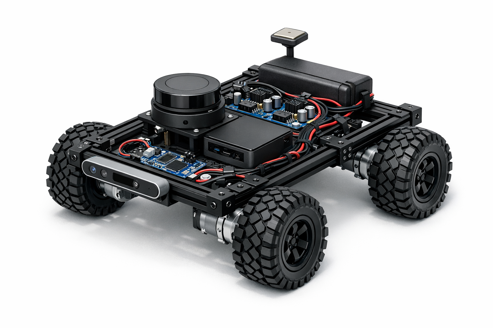
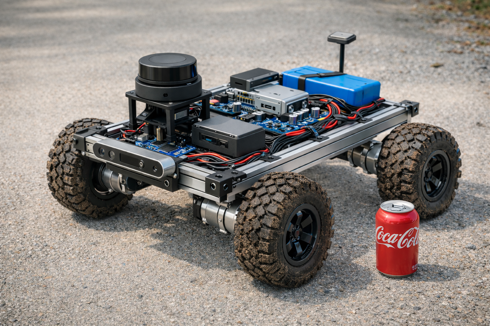

# RoverBot v1

Autonomous rover platform with on-device ROS2 and offloaded AI reasoning via encrypted WiFi link to a local GPU server.




## Specs

| Spec | Value |
|------|-------|
| Chassis | 24" x 12" T-slot aluminum |
| Motors | Pololu 37D 131:1 (76 RPM) |
| Wheels | 7.6" Wasteland (192mm) |
| Speed | 1.5 mph |
| Ground Clearance | ~4" |
| Weight | ~8.3 kg |
| Battery | 4S LiPo 8000mAh |
| Runtime | ~2+ hours |
| On-board Brain | Raspberry Pi 5 16GB (ROS2 Jazzy) |
| Off-board AI | MacBook Pro M3 Max 36GB (Ollama) |

## Hardware Summary

### On-board Compute (Raspberry Pi 5)

| Component | Details |
|-----------|---------|
| CPU | Cortex-A76 @ 2.4GHz (4 cores) |
| RAM | 16 GB LPDDR4X |
| Storage | Transcend ESD310C USB SSD |
| GPU | VideoCore VII (Vulkan 1.2) |
| Cooling | Aluminum passive case |
| Architecture | ARM64 |
| Power | ~8W typical |

### Off-board AI Server (MacBook Pro)

| Component | Details |
|-----------|---------|
| Chip | Apple M3 Max |
| CPU | 14 cores (10P + 4E) |
| GPU | 30-core integrated |
| RAM | 36 GB unified |
| AI Runtime | Ollama |
| Models | qwen2.5:32b, qwen2.5:14b |
| Connection | WiFi 6 (TLS encrypted) |

## Architecture

```
+------------------+                              +-------------------+
| Raspberry Pi 5   |                              | MacBook Pro M3    |
|  +------------+  |                              |                   |
|  | 2D Lidar   |  |  <-- RPLidar A1              |  +-------------+  |
|  +------------+  |                              |  | Ollama      |  |
|  | Depth Cam  |  |  <-- RealSense D435          |  | qwen2.5:32b |  |
|  +------------+  |                              |  +-------------+  |
|  | IMU        |  |  <-- BNO055                  |        ^          |
|  +------------+  |                              |        |          |
|  | AI-Link    |--+---------- TLS/WiFi -------->|        |          |
|  +------------+  |     Encrypted JSON-RPC       +--------+----------+
+------------------+                                 AI Inference
        |
+------------------+
| Arduino Mega     |  <-- Motor control, encoders
+------------------+
        |
+------------------+
| Cytron MDD10A x2 |  <-- Dual motor drivers
+------------------+
        |
+------------------+
| 4WD Chassis      |  <-- 24"x12" platform
+------------------+
```

## Capabilities

### On-board (Real-time, Pi 5)
- SLAM mapping (slam_toolbox)
- Autonomous navigation (Nav2)
- Motor control and odometry
- Sensor fusion (LIDAR + depth + IMU)
- Object detection (YOLOv8n via OpenVINO)
- Remote operation via web/app

### Off-loaded to AI Server (Complex reasoning)
- **Scene Analysis** - Interpret complex environments, identify context
- **Path Planning Assistance** - Handle edge cases Nav2 can't solve
- **Natural Language Commands** - Parse voice/text into robot actions
- **Object Identification** - Detailed classification beyond YOLO labels
- **Decision Making** - Mission-critical choices with reasoning
- **Anomaly Detection** - Identify unusual situations requiring intervention

### AI-Link Features
- TLS-encrypted communication over WiFi
- Async non-blocking requests
- Automatic retry with exponential backoff
- Task-specific model selection (32b for complex, 14b for fast)
- ROS2 node integration
- CLI for testing and debugging

## Software Stack

### On-board (Raspberry Pi 5)

| Layer | Component |
|-------|-----------|
| OS | Ubuntu 24.04 LTS |
| Middleware | ROS2 Jazzy |
| Navigation | Nav2 |
| SLAM | slam_toolbox |
| Vision | OpenVINO + YOLOv8n |
| AI Client | AI-Link (async, TLS) |
| Simulation | Gazebo Harmonic |
| Visualization | RViz2 |

### Off-board (MacBook Pro M3 Max)

| Layer | Component |
|-------|-----------|
| OS | macOS |
| AI Runtime | Ollama |
| Primary Model | qwen2.5:32b-instruct-q4_K_M (~20GB) |
| Fast Model | qwen2.5:14b-instruct (~9GB) |
| TLS Proxy | nginx (optional) |

## Documents

| File | Purpose |
|------|---------|
| README.md | This overview |
| ai_link/ | AI offloading module (see ai_link/README.md) |
| SHOPPING_LIST.md | Complete parts list with URLs |
| CHECKLIST.md | Shopping checklist with status |
| CHASSIS_BUILD.md | Custom 24"x12" T-slot chassis build |
| MOTOR_MOUNT_DESIGN.md | Motor mounting details |
| ROS2_GUIDE.md | ROS2 concepts and getting started |
| ROS2_SLAM_STACK.md | Full SLAM/Nav2 setup guide |
| old-parts.md | Inventory of existing parts |

## Getting Started

1. Install Ubuntu 24.04 on Pi 5
2. Install ROS2 Jazzy (see ROS2_SLAM_STACK.md)
3. Acquire hardware (see SHOPPING_LIST.md)
4. Build chassis (see CHASSIS_BUILD.md)
5. Set up AI server (see below)
6. Integrate and test

## AI Server Setup (MacBook Pro)

```bash
# Install Ollama
curl -fsSL https://ollama.com/install.sh | sh

# Pull models
ollama pull qwen2.5:32b-instruct-q4_K_M
ollama pull qwen2.5:14b-instruct

# Start server (binds to all interfaces)
OLLAMA_HOST=0.0.0.0 ollama serve
```

## AI-Link Quick Test

```bash
# On robot, test connection
cd ai_link
pip install aiohttp
python -m ai_link.cli --host <MACBOOK_IP> status
python -m ai_link.cli --host <MACBOOK_IP> generate "Hello, I am a robot."
```

## Example: Natural Language Command

```python
from ai_link import AILinkClient, AILinkConfig

config = AILinkConfig(host="192.168.1.100")

async with AILinkClient(config) as client:
    response = await client.process_command(
        "Go to the kitchen and look for a red cup"
    )
    print(response.text)
    # {"intent": "fetch", "action": "navigate",
    #  "parameters": {"location": "kitchen", "target": "red cup"}}
```
